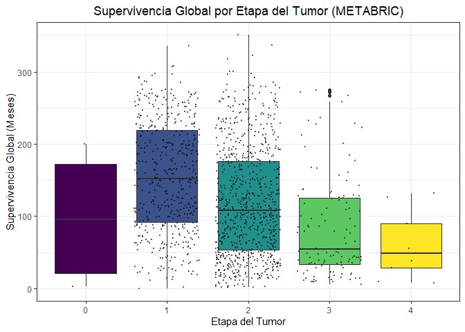
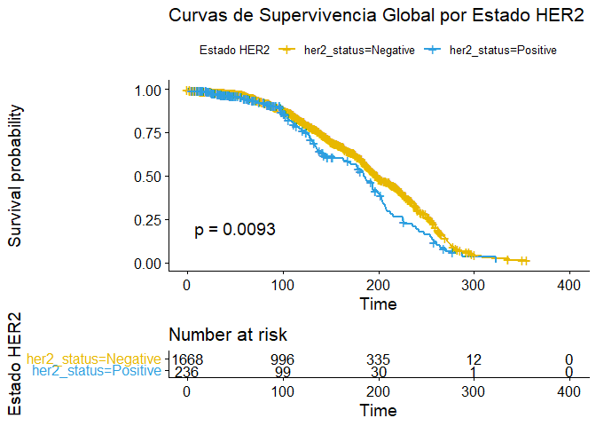

 Breast Cancer Gene
Expression Profiles 
(METABRIC)

================
Andrea Murillo Espinar, Andrea Torres Philpott
2025-12-15

# **Introducción**

El cáncer de mama es una enfermedad que presenta una amplia variabilidad
tanto a nivel clínico como molecular. En un inicio se clasificaba en
base al **grado tumoral**, el **tamaño** o el **estado ganglionar**,
pero estos criterios son insuficientes para poder explicar las
diferencias en el pronóstico y la respuesta al tratamiento que se
observan entre pacientes incluso con características clínicas similares.
(Perou et al. ([2000](#ref-perouMolecularPortraitsHuman2000))) 

El desarrollo de las tecnologías de análisis de expresión génica a gran
escala (microarrays o secuenciación de ARN) ha permitido una
caracterización más precisa a nivel molecular del cáncer de mama. Los
primeros estudios demostraron que se pueden agrupar los tumores mamarios
en **subtipos moleculares** *distintos* y cada uno de ellos, con
características biológicas y clínicas específicas. Entre los subtipos
encontramos: *Luminal A*, *Luminal B*, *HER2-positivo*, *Claudin-low* y
*Basal-like*, los cuales difieren en la expresión de genes relacionados
con receptores hormonales, proliferación celular y vías oncogénicas
clave. (Sørlie et al.
([2003](#ref-sorlieRepeatedObservationBreast2003))) 

El conjunto de datos **Breast Cancer Gene Expression Profiles** nos
proporciona información sobre los perfiles de expresión génica y
variables clínicas asociadas a tumores de mama, permitiéndonos explorar
de manera estadística la relación entre los subtipos moleculares y
distintas características biológicas del tumor. 

## Separación de datos

Primero hemos identificado los *datos clínicos* de los *datos genéticos*

``` r
dim(datos_clinicos) #veo las dimensiones de la tabla
```

    ## [1] 1904   31

``` r
str(datos_clinicos) 
```

    ## 'data.frame':    1904 obs. of  31 variables:
    ##  $ patient_id                    : int  0 2 5 6 8 10 14 22 28 35 ...
    ##  $ age_at_diagnosis              : num  75.7 43.2 48.9 47.7 77 ...
    ##  $ type_of_breast_surgery        : chr  "MASTECTOMY" "BREAST CONSERVING" "MASTECTOMY" "MASTECTOMY" ...
    ##  $ cancer_type                   : chr  "Breast Cancer" "Breast Cancer" "Breast Cancer" "Breast Cancer" ...
    ##  $ cancer_type_detailed          : chr  "Breast Invasive Ductal Carcinoma" "Breast Invasive Ductal Carcinoma" "Breast Invasive Ductal Carcinoma" "Breast Mixed Ductal and Lobular Carcinoma" ...
    ##  $ cellularity                   : chr  NA "High" "High" "Moderate" ...
    ##  $ chemotherapy                  : int  0 0 1 1 1 0 1 0 0 0 ...
    ##  $ pam50_._claudin.low_subtype   : chr  "claudin-low" "LumA" "LumB" "LumB" ...
    ##  $ cohort                        : num  1 1 1 1 1 1 1 1 1 1 ...
    ##  $ er_status_measured_by_ihc     : chr  "Positve" "Positve" "Positve" "Positve" ...
    ##  $ er_status                     : chr  "Positive" "Positive" "Positive" "Positive" ...
    ##  $ neoplasm_histologic_grade     : num  3 3 2 2 3 3 2 2 3 2 ...
    ##  $ her2_status_measured_by_snp6  : chr  "NEUTRAL" "NEUTRAL" "NEUTRAL" "NEUTRAL" ...
    ##  $ her2_status                   : chr  "Negative" "Negative" "Negative" "Negative" ...
    ##  $ tumor_other_histologic_subtype: chr  "Ductal/NST" "Ductal/NST" "Ductal/NST" "Mixed" ...
    ##  $ hormone_therapy               : int  1 1 1 1 1 1 1 1 1 0 ...
    ##  $ inferred_menopausal_state     : chr  "Post" "Pre" "Pre" "Pre" ...
    ##  $ integrative_cluster           : chr  "4ER+" "4ER+" "3" "9" ...
    ##  $ primary_tumor_laterality      : chr  "Right" "Right" "Right" "Right" ...
    ##  $ lymph_nodes_examined_positive : num  10 0 1 3 8 0 1 1 1 0 ...
    ##  $ mutation_count                : num  NA 2 2 1 2 4 4 1 4 5 ...
    ##  $ nottingham_prognostic_index   : num  6.04 4.02 4.03 4.05 6.08 ...
    ##  $ oncotree_code                 : chr  "IDC" "IDC" "IDC" "MDLC" ...
    ##  $ overall_survival_months       : num  140.5 84.6 163.7 164.9 41.4 ...
    ##  $ overall_survival              : int  1 1 0 1 0 0 1 0 0 0 ...
    ##  $ pr_status                     : chr  "Negative" "Positive" "Positive" "Positive" ...
    ##  $ radio_therapy                 : int  1 1 0 1 1 1 1 1 1 0 ...
    ##  $ X3.gene_classifier_subtype    : chr  "ER-/HER2-" "ER+/HER2- High Prolif" NA NA ...
    ##  $ tumor_size                    : num  22 10 15 25 40 31 10 29 16 28 ...
    ##  $ tumor_stage                   : num  2 1 2 2 2 4 2 2 2 2 ...
    ##  $ death_from_cancer             : chr  "Living" "Living" "Died of Disease" "Living" ...

Los datos tienen 1904 filas y 31 columnas. Cada fila se corresponde con
un paciente, por tanto, hay 1904 pacientes.

# Artículos donde sale el dataset (METABRIC)

Usado por Mucaki et al.
([2017](#ref-mucakiPredictingOutcomesHormone2017)) y Mukherjee et al.
([2018](#ref-mukherjeeAssociationsGenomicStratification2018))

# Gráfico de tumor_stage

<!-- -->

¿Son datos significativos? \### Test de normalidad Primero realizamos
una prueba de normalidad mediante `shapiro.test`.

H<sub>0</sub>: La distribución de la supervivencia global sigue una
distribución normal H<sub>1</sub>: La distribución de la supervivencia
global no sigue una distribución normal

Como p= 2.2e-16 \< 0.05, rechazamos la hipótesis nula y aceptamos la
hipótesis alternativa, la distribución de mis datos no siguen una
distribución normal.

### Test de Kruskal wallis

Para ver si existen diferencias significativas en la supervivencia
global entre las etapas del tumor, realizamos un test de Kruskal Wallis,
ya que mis datos siguen una distribución no paramétrica.

H<sub>0</sub>: No existen diferencias significativas entre las etapas
del tumor H<sub>1</sub>: Existen diferencias significativas entre las
etapas del tumor

Como p= 2.2e-16 \< 0.05, rechazamos la hipótesis nula y aceptamos la
hipótesis alternativa, existen diferencias significativas entre las
etapas del tumor

### Test post-hoc Dunn’s

Para ver entre qué grupos existe diferencia significativa

    ## 
    ##  Shapiro-Wilk normality test
    ## 
    ## data:  datos_grafico_tumor$overall_survival_months
    ## W = 0.96081, p-value < 2.2e-16

    ## 
    ##  Kruskal-Wallis rank sum test
    ## 
    ## data:  overall_survival_months by tumor_stage
    ## Kruskal-Wallis chi-squared = 116.54, df = 4, p-value < 2.2e-16

    ## [1] "Resultado del Test Post-Hoc de Dunn (Bonferroni):"

    ##    Comparison          Z      P.unadj        P.adj
    ## 1       0 - 1 -1.4817526 1.384061e-01 1.000000e+00
    ## 2       0 - 2 -0.5608899 5.748726e-01 1.000000e+00
    ## 3       1 - 2  7.9904536 1.344431e-15 1.344431e-14
    ## 4       0 - 3  0.3884114 6.977116e-01 1.000000e+00
    ## 5       1 - 3  9.0596235 1.309016e-19 1.309016e-18
    ## 6       2 - 3  4.8000564 1.586210e-06 1.586210e-05
    ## 7       0 - 4  0.8437677 3.987992e-01 1.000000e+00
    ## 8       1 - 4  3.7180335 2.007796e-04 2.007796e-03
    ## 9       2 - 4  2.3513699 1.870443e-02 1.870443e-01
    ## 10      3 - 4  0.8941321 3.712512e-01 1.000000e+00

La tasa de supervivencia es mayor en la etapa 1, es significativamente
diferente de la 2, 3 y 4. Diferencia de etapa 2 a 3, mejor tasa de
supervivencia en la 2. A mayor etapa de tumor, peor supervivencia.

# Pronóstico cáncer Her2+

``` r
# quiero relacionar survival months con her2_status: el cáncer her2+ es más agresivo frente al her2-, mi hipótesis es que va a tener menor supervivencia los her2+
unique(datos_clinicos$her2_status)
```

    ## [1] "Negative" "Positive"

``` r
str(datos_clinicos$her2_status)
```

    ##  chr [1:1904] "Negative" "Negative" "Negative" "Negative" "Negative" ...

``` r
#importante que no tenga NA y que sea un factor
datos_her2 <- datos_clinicos %>%
  filter(!is.na(her2_status)) %>%
  # Convertimos a factor, aunque es probable que ya lo sea
  mutate(her2_status = factor(her2_status))
str(datos_her2) #ahora si es un factor
```

    ## 'data.frame':    1904 obs. of  31 variables:
    ##  $ patient_id                    : int  0 2 5 6 8 10 14 22 28 35 ...
    ##  $ age_at_diagnosis              : num  75.7 43.2 48.9 47.7 77 ...
    ##  $ type_of_breast_surgery        : chr  "MASTECTOMY" "BREAST CONSERVING" "MASTECTOMY" "MASTECTOMY" ...
    ##  $ cancer_type                   : chr  "Breast Cancer" "Breast Cancer" "Breast Cancer" "Breast Cancer" ...
    ##  $ cancer_type_detailed          : chr  "Breast Invasive Ductal Carcinoma" "Breast Invasive Ductal Carcinoma" "Breast Invasive Ductal Carcinoma" "Breast Mixed Ductal and Lobular Carcinoma" ...
    ##  $ cellularity                   : chr  NA "High" "High" "Moderate" ...
    ##  $ chemotherapy                  : int  0 0 1 1 1 0 1 0 0 0 ...
    ##  $ pam50_._claudin.low_subtype   : chr  "claudin-low" "LumA" "LumB" "LumB" ...
    ##  $ cohort                        : num  1 1 1 1 1 1 1 1 1 1 ...
    ##  $ er_status_measured_by_ihc     : chr  "Positve" "Positve" "Positve" "Positve" ...
    ##  $ er_status                     : chr  "Positive" "Positive" "Positive" "Positive" ...
    ##  $ neoplasm_histologic_grade     : num  3 3 2 2 3 3 2 2 3 2 ...
    ##  $ her2_status_measured_by_snp6  : chr  "NEUTRAL" "NEUTRAL" "NEUTRAL" "NEUTRAL" ...
    ##  $ her2_status                   : Factor w/ 2 levels "Negative","Positive": 1 1 1 1 1 1 1 1 1 1 ...
    ##  $ tumor_other_histologic_subtype: chr  "Ductal/NST" "Ductal/NST" "Ductal/NST" "Mixed" ...
    ##  $ hormone_therapy               : int  1 1 1 1 1 1 1 1 1 0 ...
    ##  $ inferred_menopausal_state     : chr  "Post" "Pre" "Pre" "Pre" ...
    ##  $ integrative_cluster           : chr  "4ER+" "4ER+" "3" "9" ...
    ##  $ primary_tumor_laterality      : chr  "Right" "Right" "Right" "Right" ...
    ##  $ lymph_nodes_examined_positive : num  10 0 1 3 8 0 1 1 1 0 ...
    ##  $ mutation_count                : num  NA 2 2 1 2 4 4 1 4 5 ...
    ##  $ nottingham_prognostic_index   : num  6.04 4.02 4.03 4.05 6.08 ...
    ##  $ oncotree_code                 : chr  "IDC" "IDC" "IDC" "MDLC" ...
    ##  $ overall_survival_months       : num  140.5 84.6 163.7 164.9 41.4 ...
    ##  $ overall_survival              : int  1 1 0 1 0 0 1 0 0 0 ...
    ##  $ pr_status                     : chr  "Negative" "Positive" "Positive" "Positive" ...
    ##  $ radio_therapy                 : int  1 1 0 1 1 1 1 1 1 0 ...
    ##  $ X3.gene_classifier_subtype    : chr  "ER-/HER2-" "ER+/HER2- High Prolif" NA NA ...
    ##  $ tumor_size                    : num  22 10 15 25 40 31 10 29 16 28 ...
    ##  $ tumor_stage                   : num  2 1 2 2 2 4 2 2 2 2 ...
    ##  $ death_from_cancer             : chr  "Living" "Living" "Died of Disease" "Living" ...

``` r
unique(datos_clinicos$overall_survival)
```

    ## [1] 1 0

``` r
str(datos_clinicos$overall_survival_months)
```

    ##  num [1:1904] 140.5 84.6 163.7 164.9 41.4 ...

``` r
# 2. Crear el Objeto de Supervivencia (Surv Object)
# 'overall_survival_months' = tiempo
# 'overall_survival' = evento (1=fallecido, 0=vivo/censurado)
surv_object_her2 <- Surv(time = datos_her2$overall_survival_months, 
                         event = datos_her2$overall_survival)


## 2. Crear el objeto de supervivencia
# Tiempo: overall_survival_months
# Evento: overall_survival (1=fallecido, 0=vivo/censurado)
surv_object_her2 <- Surv(time = datos_her2$overall_survival_months, 
                         event = datos_her2$overall_survival)

# 3. Ajustar el Modelo de Kaplan-Meier
# Ajustamos la supervivencia en función del estado HER2
fit_km_her2 <- survfit(surv_object_her2 ~ her2_status, data = datos_her2)

# 4. Generar el Gráfico y el Log-rank Test
km_her2_plot <- ggsurvplot(fit_km_her2, 
                           data = datos_her2,
                           pval = TRUE,             # Muestra el valor p de la prueba Log-rank
                           risk.table = TRUE,       # Muestra la tabla de riesgo
                           legend.title = "Estado HER2",
                           title = "Curvas de Supervivencia Global por Estado HER2",
                           palette = c("#E7B800", "#2E9FDF") # Colores para HER2- y HER2+
)
```

    ## Warning: Using `size` aesthetic for lines was deprecated in ggplot2 3.4.0.
    ## ℹ Please use `linewidth` instead.
    ## ℹ The deprecated feature was likely used in the ggpubr package.
    ##   Please report the issue at <https://github.com/kassambara/ggpubr/issues>.
    ## This warning is displayed once every 8 hours.
    ## Call `lifecycle::last_lifecycle_warnings()` to see where this warning was
    ## generated.

``` r
print(km_her2_plot)
```

    ## Ignoring unknown labels:
    ## • colour : "Estado HER2"

<!-- -->

``` r
#Calculamos el Modelo de Cox
# La fórmula es: objeto_supervivencia ~ predictor
cox_her2_model <- coxph(surv_object_her2 ~ her2_status, 
                        data = datos_her2)

# 2. Imprimir el resumen del modelo para obtener el Hazard Ratio (HR)
print("--- Resumen del Modelo de Cox para Estado HER2 ---")
```

    ## [1] "--- Resumen del Modelo de Cox para Estado HER2 ---"

``` r
summary(cox_her2_model)
```

    ## Call:
    ## coxph(formula = surv_object_her2 ~ her2_status, data = datos_her2)
    ## 
    ##   n= 1904, number of events= 801 
    ## 
    ##                       coef exp(coef) se(coef)     z Pr(>|z|)   
    ## her2_statusPositive 0.2920    1.3391   0.1126 2.594   0.0095 **
    ## ---
    ## Signif. codes:  0 '***' 0.001 '**' 0.01 '*' 0.05 '.' 0.1 ' ' 1
    ## 
    ##                     exp(coef) exp(-coef) lower .95 upper .95
    ## her2_statusPositive     1.339     0.7468     1.074      1.67
    ## 
    ## Concordance= 0.514  (se = 0.007 )
    ## Likelihood ratio test= 6.24  on 1 df,   p=0.01
    ## Wald test            = 6.73  on 1 df,   p=0.01
    ## Score (logrank) test = 6.77  on 1 df,   p=0.009

Interpretación: existen diferencias significativas en la supervivencia
global entre subtipos Her2+ y Her2-. El cáncer de mama Her2+ se asocia
con un riesgo de muerte de 33,91% mayor en cualquier momento en
comparación con otros subtipos de cáncer de mama.

# Pronóstico cáncer Triple negativo

Ahora vamos a ver el pronóstico del cáncer Triple negativo, se define
por la ausencia de tres receptores, ER (receptor de estrógeno), PR
(receptor de progesterona) y receptor HER2-

    ## [1] "Positive" "Negative"

    ## [1] "Negative" "Positive"

    ## [1] "Negative" "Positive"

Asumimos que “Negative” significa ausencia de receptor. Usaremos el data
frame original de datos clínicos.

``` r
datos_tnbc <- datos_clinicos %>%
  select(overall_survival_months, overall_survival, 
         er_status, pr_status, her2_status) %>%
  
  # 1. Crear la variable TNBC_status
  mutate(
    TNBC_status = case_when(
      er_status == "Negative" & pr_status == "Negative" & her2_status == "Negative" ~ "TNBC",
      TRUE ~ "Non_TNBC"
    )
  ) %>%
  
  # 2. Filtrar filas con NAs en los marcadores de supervivencia
  filter(!is.na(overall_survival_months) & !is.na(overall_survival)) %>%
  
  # 3. Convertir a factor para el análisis
  mutate(TNBC_status = factor(TNBC_status))

# 4. Crear el objeto de supervivencia
surv_object_tnbc <- Surv(datos_tnbc$overall_survival_months, 
                         datos_tnbc$overall_survival)
# A. Kaplan-Meier (Ver la diferencia visual y obtener el p-valor)
km_tnbc <- survfit(surv_object_tnbc ~ TNBC_status, data = datos_tnbc)
```

``` r
ggsurvplot(km_tnbc, 
           data = datos_tnbc,
           pval = TRUE,             # Mostrar p-valor
           risk.table = TRUE,       # Mostrar tabla de riesgo
           legend.title = "Estado Triple Negativo",
           title = "Supervivencia Global (TNBC vs. No-TNBC)")
```

    ## Ignoring unknown labels:
    ## • colour : "Estado Triple Negativo"

<!-- -->

``` r
# B. Modelo de Cox (Cuantificar el riesgo HR)
cox_tnbc_model <- coxph(surv_object_tnbc ~ TNBC_status, data = datos_tnbc)

print("Resumen del Modelo de Cox para TNBC:")
```

    ## [1] "Resumen del Modelo de Cox para TNBC:"

``` r
summary(cox_tnbc_model)
```

    ## Call:
    ## coxph(formula = surv_object_tnbc ~ TNBC_status, data = datos_tnbc)
    ## 
    ##   n= 1904, number of events= 801 
    ## 
    ##                    coef exp(coef) se(coef)     z Pr(>|z|)  
    ## TNBC_statusTNBC 0.19262   1.21242  0.09371 2.055   0.0398 *
    ## ---
    ## Signif. codes:  0 '***' 0.001 '**' 0.01 '*' 0.05 '.' 0.1 ' ' 1
    ## 
    ##                 exp(coef) exp(-coef) lower .95 upper .95
    ## TNBC_statusTNBC     1.212     0.8248     1.009     1.457
    ## 
    ## Concordance= 0.51  (se = 0.008 )
    ## Likelihood ratio test= 4.05  on 1 df,   p=0.04
    ## Wald test            = 4.23  on 1 df,   p=0.04
    ## Score (logrank) test = 4.24  on 1 df,   p=0.04

Existen diferencias significativas, “El cáncer de mama Triple Negativo
(TNBC) se asocia con un riesgo de muerte 21.24% mayor en cualquier
momento dado en comparación con otros subtipos de cáncer de mama
(No-TNBC)

``` r
# vamos a hacerlo otra vez omitiendo NC
  # Limpieza y preparación de datos (Ajustado)
datos_combinados <- data %>% 
select(`pam50_._claudin.low_subtype`, mutation_count) %>% 
    
    # AÑADIR FILTRO PARA ELIMINAR "NC" (Not Classified)
filter(!is.na(`pam50_._claudin.low_subtype`) & 
             !is.na(mutation_count) & 
             `pam50_._claudin.low_subtype` != "NC") 
  
  # Nota: Después de filtrar, R puede conservar los niveles 'NC' en la metadata.
  # Para asegurarnos de que desaparezca del gráfico, convertimos la columna a factor, 
  # forzando a R a recalcular los niveles (se hace automáticamente si la columna ya era factor).
  datos_combinados <- datos_combinados %>%
    mutate(`pam50_._claudin.low_subtype` = factor(`pam50_._claudin.low_subtype`))
  
  
  # Gráfico (Box-Violin Plot)
  datos_combinados %>% 
    ggplot(aes(x = `pam50_._claudin.low_subtype`, y = mutation_count, fill = `pam50_._claudin.low_subtype`)) +
    geom_violin(alpha = 0.6, show.legend = FALSE) + 
    geom_boxplot(width = 0.1, color = "black", alpha = 0.7, show.legend = FALSE) + 
    labs(
      title = "Carga Mutacional por Subtipo Molecular PAM50",
      x = "Subtipo Molecular",
      y = "Conteo de Mutaciones",
      fill = "Subtipo" 
    ) +
    theme_bw() +
    scale_fill_viridis_d()
```

<!-- -->

# Ahora quiero ver si está relacionado estar en pre-post menopausia con el cáncer de mama

Quiero ver cuantas pacientes son pre-post menopáusicas \## Limpieza y
preparación \# Creo un data frame limpio solo con la variable de
interés, eliminando valores vacíos o NAs.

``` r
datos_grafico_menopausia <- datos_clinicos %>%
  filter(!is.na(inferred_menopausal_state) & inferred_menopausal_state != "") %>%
  mutate(inferred_menopausal_state = factor(inferred_menopausal_state))
```

# 2. Genero el gráfico de barras

``` r
grafico_barras_menopausia <- ggplot(datos_grafico_menopausia, 
                                    aes(x = inferred_menopausal_state, fill = inferred_menopausal_state)) +
  geom_bar() +
  
  # Añadir las etiquetas de conteo encima de cada barra
  geom_text(stat = 'count', aes(label = after_stat(count)), vjust = -0.5, size = 5) +
  
  labs(title = "Distribución de Pacientes por Estado Menopáusico",
       x = "Estado Menopáusico",
       y = "Número de Pacientes") +
  
  theme_minimal() +
  theme(legend.position = "none", plot.title = element_text(hjust = 0.5)) +
  scale_fill_viridis_d(option= "D")

print(grafico_barras_menopausia)
```

<!-- -->

<div id="refs" class="references csl-bib-body hanging-indent"
entry-spacing="0">

<div id="ref-mucakiPredictingOutcomesHormone2017" class="csl-entry">

Mucaki, Eliseos J., Katherina Baranova, Huy Q. Pham, Iman Rezaeian, Dimo
Angelov, Alioune Ngom, Luis Rueda, and Peter K. Rogan. 2017. “Predicting
Outcomes of Hormone and Chemotherapy in the Molecular Taxonomy of Breast
Cancer International Consortium (METABRIC) Study by
<span class="nocase">Biochemically-inspired Machine Learning</span>.”
*F1000Research* 5 (May): 2124.
<https://doi.org/10.12688/f1000research.9417.3>.

</div>

<div id="ref-mukherjeeAssociationsGenomicStratification2018"
class="csl-entry">

Mukherjee, A., R. Russell, Suet-Feung Chin, B. Liu, O. M. Rueda, H. R.
Ali, G. Turashvili, et al. 2018. “Associations Between Genomic
Stratification of Breast Cancer and Centrally Reviewed Tumour Pathology
in the METABRIC Cohort.” *Npj Breast Cancer* 4 (1): 5.
<https://doi.org/10.1038/s41523-018-0056-8>.

</div>

<div id="ref-perouMolecularPortraitsHuman2000" class="csl-entry">

Perou, C. M., T. Sørlie, M. B. Eisen, M. van de Rijn, S. S. Jeffrey, C.
A. Rees, J. R. Pollack, et al. 2000. “Molecular Portraits of Human
Breast Tumours.” *Nature* 406 (6797): 747–52.
<https://doi.org/10.1038/35021093>.

</div>

<div id="ref-sorlieRepeatedObservationBreast2003" class="csl-entry">

Sørlie, Therese, Robert Tibshirani, Joel Parker, Trevor Hastie, J. S.
Marron, Andrew Nobel, Shibing Deng, et al. 2003. “Repeated Observation
of Breast Tumor Subtypes in Independent Gene Expression Data Sets.”
*Proceedings of the National Academy of Sciences* 100 (14): 8418–23.
<https://doi.org/10.1073/pnas.0932692100>.

</div>

</div>
