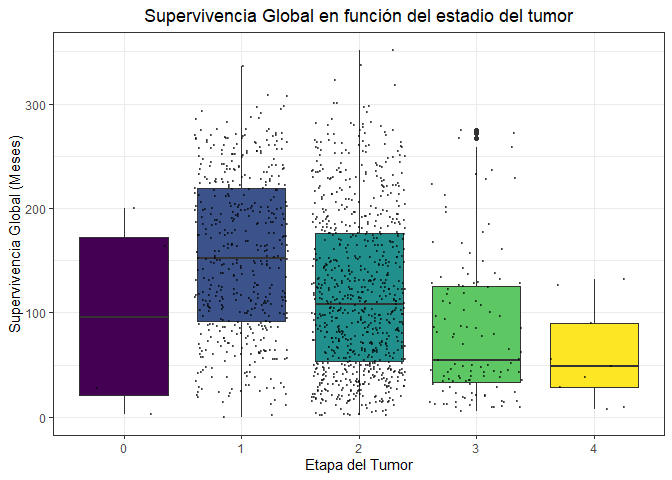
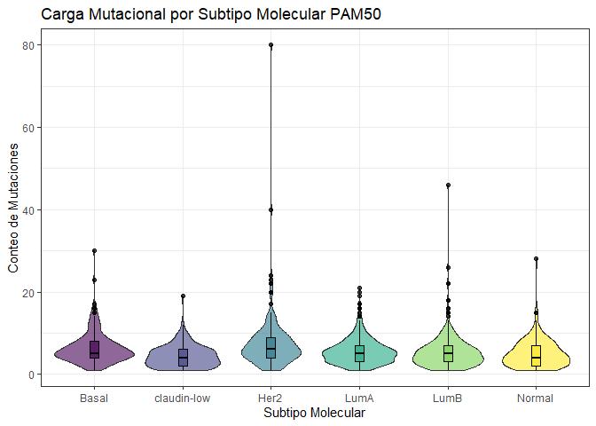

 Breast Cancer Gene
Expression Profiles 
(METABRIC)

================
Andrea Murillo Espinar, Andrea Torres Philpott
2025-12-17

# Introducción

El cáncer de mama es una enfermedad que presenta una amplia variabilidad
tanto a nivel clínico como molecular. En un inicio se clasificaba en
base al **grado tumoral**, el **tamaño** o el **estado ganglionar**,
pero estos criterios son insuficientes para poder explicar las
diferencias en el pronóstico y la respuesta al tratamiento que se
observan entre pacientes incluso con características clínicas similares.
(Perou et al. ([2000](#ref-perouMolecularPortraitsHuman2000))) 

El desarrollo de las tecnologías de análisis de expresión génica a gran
escala (microarrays o secuenciación de ARN) ha permitido una
caracterización más precisa a nivel molecular del cáncer de mama. Los
primeros estudios demostraron que se pueden agrupar los tumores mamarios
en **subtipos moleculares** *distintos* y cada uno de ellos, con
características biológicas y clínicas específicas. Entre los subtipos
encontramos: *Luminal A*, *Luminal B*, *HER2-positivo*, *Claudin-low* y
*Basal-like*, los cuales difieren en la expresión de genes relacionados
con receptores hormonales, proliferación celular y vías oncogénicas
clave. (Sørlie et al.
([2003](#ref-sorlieRepeatedObservationBreast2003))) 

El conjunto de datos <span style="color:purple;">Breast Cancer Gene
Expression Profiles</span> nos proporciona información sobre los
perfiles de expresión génica y variables clínicas asociadas a tumores de
mama, permitiéndonos explorar estadísticamente la relación entre los
subtipos moleculares y distintas características biológicas del tumor. 

<figure>

<figcaption aria-hidden="true">Figura 1: Cánceres más frecuentemente
diagnosticados en el mundo en ambos sexos. Fuente: GLOBOCAN 2020 <span
class="citation" data-cites="globocan">Global Cancer Observatory (<a
href="#ref-globocan" role="doc-biblioref">2024</a>)</span>
.</figcaption>
</figure>

# Materiales y métodos

## Tratamiento y análisis de datos

Con la librería `dplyr` hemos seleccionado, manipulado y limpiado la
base de datos. ([Wickham et al. 2023](#ref-R-dplyr))

El análisis de supervivencia se realizó con el paquete `survival` :
incluye curvas de Kaplan-Meier y los modelos de regresión de Cox
(Univariante y Multivariante) ([Therneau 2024](#ref-survival-package);
[Terry M. Therneau and Patricia M. Grambsch 2000](#ref-survival-book))

Para la comparación entre grupos en el análisis no paramétrico se
utilizó la prueba post-hoc Dunn’s, mediante el paquete `FSA`. ([Ogle et
al. 2025](#ref-fsa))

## Visualización

Las gráficas se realizaron con el paquete `ggplot2` ([Wickham et al.
2025](#ref-R-ggplot2); [Wickham 2016](#ref-ggplot22016)) Para la
representación de las curvas de Kaplan-Meier empleamos el paquete
`survminer` ([Kassambara, Kosinski, and Biecek 2025](#ref-survminer))

## Generación del informe

Para la creación de este informe hemos utilizado el paquete knitr Xie
([2014](#ref-knitr2014)) y pandoc.

# Tratamiento de datos

Con la información proporcionada por la base de datos, dividimos los
datos en *datos clínicos* y *datos genéticos*

1.  Cargamos la base de datos descargada de Kaggle
2.  Muestro la base de datos parcialmente
3.  Selecciono los datos clínicos y los genéticos
4.  Convierto valores vacíos a NA

``` r
# 1. Cargamos la base de datos
data <- read.csv("C:/Users/usuario/Downloads/archive/METABRIC_RNA_Mutation.csv")

# 2. Muestro base de datos parcialmente
col_datosclinicos <- colnames(data) %>% 
  head(n = 31) # Son los datos clínicos

# Selecciono los datos clínicos
datos_clinicos <- data %>% 
  select(col_datosclinicos)

# Convierto valores vacíos a NA
datos_clinicos[datos_clinicos == ""] <- NA
```

``` r
# Hago lo mismo pero para los datos genéticos
datos_geneticos <- data %>% 
  select(32:693) # Sabemos que el resto son datos genéticos

# Convierto valores vacíos a NA
datos_geneticos[datos_geneticos == ""] <- NA
```

La ***base de datos global*** tiene 1904 filas y 693 columnas. Cada fila
se corresponde con un paciente, por tanto, hay 1904 pacientes. 

Los ***datos clínicos*** tienen 1904 filas y 31 columnas. 

Los ***datos genéticos*** tienen 1904 filas y 662 columnas. 

# Dataset (METABRIC)

Esta base de datos ha sido usada por Mucaki et al.
([2017](#ref-mucakiPredictingOutcomesHormone2017)) y Mukherjee et al.
([2018](#ref-mukherjeeAssociationsGenomicStratification2018))

# Supervivencia

## En función del estadio del tumor

Limpieza y preparación de datos 

1.  Hemos seleccionado del conjunto de `datos_clinicos` las variables de
    interés: `tumor_stage` y `overall_survival_months`
2.  Convertimos los espacios vacíos a NA
3.  Filtramos los NA
4.  Convertimos `tumor_stage`a factor para la gráfica.

Generación y visualización de la gráfica 

1.  Mediante `geom_boxplot` y `geom_jitter` generamos la figura
    @ref(fig:grafico-superv-estadiotumor)
2.  Muestro la figura

<figure>

<figcaption aria-hidden="true">Supervivencia Global por etapa del
Tumor(METABRIC).</figcaption>
</figure>

La @ref(fig:grafico-superv-estadiotumor) nos muestra la distribución de
la supervivencia global en función del estadio del tumor en pacientes
con Cáncer de Mama.  Se puede observar una clara diferencia en la
supervivencia entre estadios tumorales.

¿Son datos significativos? 

### Test de normalidad

Primero realizamos una prueba de normalidad mediante `shapiro.test`.

H<sub>0</sub>: La distribución de la supervivencia global sigue una
distribución normal  

H<sub>1</sub>: La distribución de la supervivencia global no sigue una
distribución normal

Como p= 2.2e-16 \< 0.05, rechazamos la hipótesis nula y aceptamos la
hipótesis alternativa, la distribución de mis datos no siguen una
distribución normal.

### Test de Kruskal wallis

Para ver si existen diferencias significativas en la supervivencia
global entre las etapas del tumor, realizamos un test de Kruskal Wallis,
ya que mis datos siguen una distribución no paramétrica.

H<sub>0</sub>: No existen diferencias significativas entre las etapas
del tumor   
H<sub>1</sub>: Existen diferencias significativas entre las etapas del
tumor

Como p= 2.2e-16 \< 0.05, rechazamos la hipótesis nula y aceptamos la
hipótesis alternativa, existen diferencias significativas entre las
etapas del tumor.

### Test post-hoc Dunn’s

Para ver entre qué grupos existe diferencia significativa tenemos que
realizar un test post-hoc.  
Concretamente usamos Dunn’s ya que los datos no siguen una distribución
paramétrica.

    ## 
    ##  Shapiro-Wilk normality test
    ## 
    ## data:  datos_grafico_tumor$overall_survival_months
    ## W = 0.96081, p-value < 2.2e-16

    ## 
    ##  Kruskal-Wallis rank sum test
    ## 
    ## data:  overall_survival_months by tumor_stage
    ## Kruskal-Wallis chi-squared = 116.54, df = 4, p-value < 2.2e-16

<table>

<caption>

Tabla de resultados del Test de Dunn’s.
</caption>

<thead>

<tr>

<th style="text-align:left;">

Comparison
</th>

<th style="text-align:center;">

Z
</th>

<th style="text-align:center;">

P.unadj
</th>

<th style="text-align:center;">

P.adj
</th>

</tr>

</thead>

<tbody>

<tr>

<td style="text-align:left;">

1 - 2
</td>

<td style="text-align:center;">

7.99045
</td>

<td style="text-align:center;">

0e+00
</td>

<td style="text-align:center;">

0.00000
</td>

</tr>

<tr>

<td style="text-align:left;">

1 - 3
</td>

<td style="text-align:center;">

9.05962
</td>

<td style="text-align:center;">

0e+00
</td>

<td style="text-align:center;">

0.00000
</td>

</tr>

<tr>

<td style="text-align:left;">

2 - 3
</td>

<td style="text-align:center;">

4.80006
</td>

<td style="text-align:center;">

0e+00
</td>

<td style="text-align:center;">

0.00002
</td>

</tr>

<tr>

<td style="text-align:left;">

1 - 4
</td>

<td style="text-align:center;">

3.71803
</td>

<td style="text-align:center;">

2e-04
</td>

<td style="text-align:center;">

0.00201
</td>

</tr>

</tbody>

</table>

La tasa de supervivencia es mayor en la etapa 1, es significativamente
diferente de la 2, 3 y 4. Diferencia de etapa 2 a 3, mejor tasa de
supervivencia en la 2. 

A mayor etapa de tumor, peor supervivencia.

Estos resultados evidencian la tendencia decreciente de la supervivencia
global a medida que el tumor avanza estadios.

# Carga mutacional por subtipo

Seleccionamos `pam50_._claudin.low_subtype` (Subtipos de Cáncer de Mama)
y `mutation_count`, preparamos los datos y creamos un gráfico.

<figure>

<figcaption aria-hidden="true">Carga mutacional por
subtipo.</figcaption>
</figure>

La Figura @ref(fig:cancersubtipos) nos permite observar la carga
mutacional para los distintos subtipos moleculares de cáncer de mama
definidos (Basal, Claudin-low, HER2, Luminal A, Luminal B y Normal)

La gran mayoría de pacientes, independientemente de su subtipo, tienen
una carga mutacional baja (entre 0 y 10 mutaciones). 

El subtipo Her2 muestra una tendencia hacia una carga mutacional
superior en comparación al subtipo Claudin-Low.

Lo más llamativo del gráfico son los **outliers**. El caso más extremo
es Her2, ya que parece haber un paciente con 80 mutaciones. Esto puede
deberse a un fallo o, si son verdaderas mutaciones, a alta inestabilidad
genómica.

# Pronóstico cáncer Her2+

## Modelo univariante

Seleccionamos variables de supervivencia (`overall_survival_months` y
`overall_survival`) y estado de Her2 (`her2_status`)

<figure>

<figcaption aria-hidden="true">Curvas de supervivencia en función de
Her2.</figcaption>
</figure>

``` r
# Modelo de Cox
# La fórmula es: objeto_supervivencia ~ predictor
cox_her2_model <- coxph(surv_object_her2 ~ her2_status, 
                        data = datos_her2)

# 2. Imprimimos el resumen del modelo para obtener el Hazard Ratio (HR)
print("Resumen del Modelo de Cox para Estado HER2")
```

    ## [1] "Resumen del Modelo de Cox para Estado HER2"

``` r
summary(cox_her2_model)
```

    ## Call:
    ## coxph(formula = surv_object_her2 ~ her2_status, data = datos_her2)
    ## 
    ##   n= 1904, number of events= 801 
    ## 
    ##                       coef exp(coef) se(coef)     z Pr(>|z|)   
    ## her2_statusPositive 0.2920    1.3391   0.1126 2.594   0.0095 **
    ## ---
    ## Signif. codes:  0 '***' 0.001 '**' 0.01 '*' 0.05 '.' 0.1 ' ' 1
    ## 
    ##                     exp(coef) exp(-coef) lower .95 upper .95
    ## her2_statusPositive     1.339     0.7468     1.074      1.67
    ## 
    ## Concordance= 0.514  (se = 0.007 )
    ## Likelihood ratio test= 6.24  on 1 df,   p=0.01
    ## Wald test            = 6.73  on 1 df,   p=0.01
    ## Score (logrank) test = 6.77  on 1 df,   p=0.009

La Figura @ref(fig:figuracox) nos muestra las curvas de supervivencia
global mediante el método de Kaplan-Meier para pacientes con Cáncer de
Mama Her2+ o Her2-. 

Como p\<0.05, sabemos que existen diferencias significativas en la
supervivencia global entre subtipos Her2+ y Her2-. 

El cáncer de mama Her2+ se asocia con un riesgo de muerte de 33,91%
mayor en cualquier momento en comparación con otros subtipos de cáncer
de mama.

## Modelo multivariante

Hacemos un modelo multivariante para ver si el riesgo asociado a Her2 se
ve afectado por otros factores como: etapa del tumor, edad,
quimioterapia.

``` r
# 1. Seleccionamos y limpiamos solo las filas necesarias para el modelo multivariante
datos_multivariante <- datos_clinicos %>%
  select(overall_survival_months, overall_survival, # Variables de tiempo/evento
         her2_status, tumor_stage, age_at_diagnosis, chemotherapy) %>% # Covariables
  
  # Filtramos NAs de las variables del modelo
  filter(!is.na(her2_status) & 
           !is.na(tumor_stage) & 
           !is.na(age_at_diagnosis) & 
           !is.na(chemotherapy)) %>%
  
  # Las variables categóricas tienen que ser factores
  mutate(her2_status = factor(her2_status),
         tumor_stage = factor(tumor_stage),
         chemotherapy = factor(chemotherapy)) 
```

``` r
# 2. Creamos el objeto de supervivencia (Surv Object)
surv_object_multi <- Surv(time = datos_multivariante$overall_survival_months, 
                          event = datos_multivariante$overall_survival)
```

``` r
# 3. Modelo de Cox Multivariante
cox_multivariante_model <- coxph(
  surv_object_multi ~ her2_status + tumor_stage + age_at_diagnosis + chemotherapy,
  data = datos_multivariante
)
```

``` r
# 4. Muestro resultado del modelo
summary(cox_multivariante_model) 
```

    ## Call:
    ## coxph(formula = surv_object_multi ~ her2_status + tumor_stage + 
    ##     age_at_diagnosis + chemotherapy, data = datos_multivariante)
    ## 
    ##   n= 1403, number of events= 611 
    ## 
    ##                          coef exp(coef)  se(coef)      z Pr(>|z|)    
    ## her2_statusPositive  0.125418  1.133622  0.134844  0.930   0.3523    
    ## tumor_stage1        -0.993585  0.370247  0.587133 -1.692   0.0906 .  
    ## tumor_stage2        -1.061185  0.346046  0.589160 -1.801   0.0717 .  
    ## tumor_stage3        -1.096855  0.333920  0.618273 -1.774   0.0761 .  
    ## tumor_stage4        -0.593809  0.552220  1.159419 -0.512   0.6085    
    ## age_at_diagnosis    -0.001498  0.998503  0.003943 -0.380   0.7041    
    ## chemotherapy1        0.615077  1.849800  0.121902  5.046 4.52e-07 ***
    ## ---
    ## Signif. codes:  0 '***' 0.001 '**' 0.01 '*' 0.05 '.' 0.1 ' ' 1
    ## 
    ##                     exp(coef) exp(-coef) lower .95 upper .95
    ## her2_statusPositive    1.1336     0.8821   0.87034     1.477
    ## tumor_stage1           0.3702     2.7009   0.11714     1.170
    ## tumor_stage2           0.3460     2.8898   0.10905     1.098
    ## tumor_stage3           0.3339     2.9947   0.09940     1.122
    ## tumor_stage4           0.5522     1.8109   0.05691     5.358
    ## age_at_diagnosis       0.9985     1.0015   0.99082     1.006
    ## chemotherapy1          1.8498     0.5406   1.45667     2.349
    ## 
    ## Concordance= 0.557  (se = 0.015 )
    ## Likelihood ratio test= 41.03  on 7 df,   p=8e-07
    ## Wald test            = 45.92  on 7 df,   p=9e-08
    ## Score (logrank) test = 47.52  on 7 df,   p=4e-08

El factor que más afecta al riesgo de muerte es la quimioterapia, ya que
p\<0.05, HR: 1.85 Esto significa que los pacientes que recibieron
quimioterapia tienen un riesgo de muerte 1.85 veces (85% de riesgo)
mayor que aquellos que no la recibieron.

Sesgo de selección: La quimioterapia no está causando la muerte. Es un
tratamiento administrado a pacientes con cáncer avanzado, más agresivo,
con peor pronóstico. Por lo tanto, el modelo muestra la asociación entre
la quimioterapia y el riesgo.

El estado her2+, en análisis univariante es pronóstico, pero no es un
predictor en la supervivencia si se tiene en cuenta quimioterapia,
estadio tumoral y edad.

# Pronóstico cáncer Triple negativo

Ahora vamos a ver cuál es el pronóstico del Cáncer Triple negativo.  El
Cáncer de Mama Triple Negativo (TNBC) se define por la ausencia de tres
receptores, ER (receptor de estrógeno), PR (receptor de progesterona) y
receptor HER2.

Asumimos que “Negative” significa ausencia de receptor en las variables
`er_status`, `pr_status` y `her2_status`

Creamos una nueva variable `TNBC_status` seleccionando los valores
negativos simultáneos en los receptores mencionados anteriormente. El
resto de pacientes se agrupan en `Non_TNBC`, es decir, cualquier otro
subtipo de cáncer de mama distinto de TNBC.

<figure>

<figcaption aria-hidden="true">Supervivencia global TNBC vs
TNBC.</figcaption>
</figure>

    ## [1] "Resumen del Modelo de Cox para TNBC"

    ## Call:
    ## coxph(formula = surv_object_tnbc ~ TNBC_status, data = datos_tnbc)
    ## 
    ##   n= 1904, number of events= 801 
    ## 
    ##                    coef exp(coef) se(coef)     z Pr(>|z|)  
    ## TNBC_statusTNBC 0.19262   1.21242  0.09371 2.055   0.0398 *
    ## ---
    ## Signif. codes:  0 '***' 0.001 '**' 0.01 '*' 0.05 '.' 0.1 ' ' 1
    ## 
    ##                 exp(coef) exp(-coef) lower .95 upper .95
    ## TNBC_statusTNBC     1.212     0.8248     1.009     1.457
    ## 
    ## Concordance= 0.51  (se = 0.008 )
    ## Likelihood ratio test= 4.05  on 1 df,   p=0.04
    ## Wald test            = 4.23  on 1 df,   p=0.04
    ## Score (logrank) test = 4.24  on 1 df,   p=0.04

La Figura @ref(fig:figsurv) nos muestra las curvas de supervivencia
global mediante el método de Kaplan-Meier para pacientes con Cáncer de
Mama Triple Negativo (TNBC) y No Triple Negativo (No-TNBC)

Existen diferencias significativas, entre el subtipo Triple Negativo y
No Triple Negativo.

> “El cáncer de mama Triple Negativo (TNBC) se asocia con un riesgo de
> muerte 21.24% mayor en cualquier momento dado en comparación con otros
> subtipos de cáncer de mama (No-TNBC) ([Cisternas,
> n.d.](#ref-cisternasCancerMamaTriple))

Los resultados son coherentes, ya que el Cáncer de Mama Triple Negativo
se asocia a un pronóstico más desfavorable por una mayor agresividad y a
la ausencia de dianas terapéuticas específicas.

# Menopausia y cáncer de mama

Quiero ver cuantas pacientes son pre/post menopáusicas 

Creo un data frame limpio solo con la variable de interés, eliminando
valores vacíos o NAs.

Genero el gráfico de barras mediante `geom_bar` 

La Figura @ref(fig:graficomenop) representa la distribución de las
pacientes con cáncer de mama según estado menopáusico, podemos observar
que el conjunto de personas que forman parte de este estudio eran
mayoritariamente pacientes post-menopáusicas **(1493 casos)** frente a
pacientes pre-menopáusicas **(411 casos)**

Esta diferencia refleja una distribución desigual entre ambos grupos. El
estado predominante post-menopáusico indica que la mayoría de los casos
corresponden a mujeres de mayor edad, siendo la edad un factor clave en
los estudios clínicos.

# Conclusión

El análisis de los perfiles de expresión génica en cáncer de mama
constituye una herramienta fundamental para comprender la complejidad
biológica de los distintos subtipos de esta enfermedad. Los estudios
actuales demuestran que la integración de datos genómicos y clínicos
permiten identificar los subgrupos con diferencias pronósticas y
terapéuticas claras, es decir, no solo mejora la clasificación molecular
de los tumores, sino que además ofrece información valiosa para decidir
clínicamente. ([Amevor et al.
2025](#ref-amevorIntegrativePrognosticModeling2025)) 

Estos avances indican que la bioinformática no solo ayuda a entender de
manera molecular al cáncer de mama, sino que también tiene un impacto
directo en la calidad de vida de las pacientes, ya que, posibilita
tratamientos más personalizados y mejora la predicción de resultados
clínicos, contribuyendo a estrategias terapéuticas más eficaces y menos
tóxicas. ([Hsieh, Huang, and Tseng
2025](#ref-hsiehMultigeneExpressionAssays2025)) 

# Reproducibilidad

Para asegurar la reproducibilidad de los resultados es necesario conocer
el sistema operativo y la versión de software y paquetes

## Información de la sesión y referencias

    ## R version 4.5.2 (2025-10-31 ucrt)
    ## Platform: x86_64-w64-mingw32/x64
    ## Running under: Windows 11 x64 (build 26200)
    ## 
    ## Matrix products: default
    ##   LAPACK version 3.12.1
    ## 
    ## locale:
    ## [1] LC_COLLATE=Spanish_Spain.utf8  LC_CTYPE=Spanish_Spain.utf8   
    ## [3] LC_MONETARY=Spanish_Spain.utf8 LC_NUMERIC=C                  
    ## [5] LC_TIME=Spanish_Spain.utf8    
    ## 
    ## time zone: Europe/Madrid
    ## tzcode source: internal
    ## 
    ## attached base packages:
    ## [1] stats     graphics  grDevices utils     datasets  methods   base     
    ## 
    ## other attached packages:
    ## [1] bookdown_0.46   knitr_1.50      survminer_0.5.1 ggpubr_0.6.2   
    ## [5] survival_3.8-3  FSA_0.10.0      ggplot2_4.0.1   dplyr_1.1.4    
    ## 
    ## loaded via a namespace (and not attached):
    ##  [1] generics_0.1.4     tidyr_1.3.1        xml2_1.5.1         rstatix_0.7.3     
    ##  [5] stringi_1.8.7      lattice_0.22-7     digest_0.6.39      magrittr_2.0.4    
    ##  [9] evaluate_1.0.5     grid_4.5.2         RColorBrewer_1.1-3 fastmap_1.2.0     
    ## [13] Matrix_1.7-4       backports_1.5.0    Formula_1.2-5      ggtext_0.1.2      
    ## [17] gridExtra_2.3      purrr_1.2.0        viridisLite_0.4.2  scales_1.4.0      
    ## [21] abind_1.4-8        cli_3.6.5          KMsurv_0.1-6       rlang_1.1.6       
    ## [25] litedown_0.8       commonmark_2.0.0   splines_4.5.2      withr_3.0.2       
    ## [29] yaml_2.3.11        tools_4.5.2        ggsignif_0.6.4     dunn.test_1.3.6   
    ## [33] km.ci_0.5-6        broom_1.0.11       vctrs_0.6.5        R6_2.6.1          
    ## [37] zoo_1.8-14         lifecycle_1.0.4    stringr_1.6.0      car_3.1-3         
    ## [41] pkgconfig_2.0.3    pillar_1.11.1      gtable_0.3.6       Rcpp_1.1.0        
    ## [45] glue_1.8.0         data.table_1.17.8  xfun_0.54          tibble_3.3.0      
    ## [49] tidyselect_1.2.1   rstudioapi_0.17.1  farver_2.1.2       xtable_1.8-4      
    ## [53] survMisc_0.5.6     htmltools_0.5.9    labeling_0.4.3     rmarkdown_2.30    
    ## [57] carData_3.0-5      compiler_4.5.2     S7_0.2.1           markdown_2.0      
    ## [61] gridtext_0.1.5

# Bibliografía

<div id="refs" class="references csl-bib-body hanging-indent"
entry-spacing="0">

<div id="ref-amevorIntegrativePrognosticModeling2025" class="csl-entry">

Amevor, Robert, Emmanuel Kubuafor, Dennis Baidoo, Junaidu Salifu,
Koshali Muthunama Gonnage, and Onyedikachi Joshua Okeke. 2025.
“Integrative Prognostic Modeling of Breast Cancer Survival with Gene
Expression and Clinical Data.” August 22, 2025.
<https://doi.org/10.48550/arXiv.2508.16740>.

</div>

<div id="ref-cisternasCancerMamaTriple" class="csl-entry">

Cisternas, T. n.d. “Cáncer de mama Triple Negativo.”

</div>

<div id="ref-globocan" class="csl-entry">

Global Cancer Observatory. 2024. “Las Cifras Del Cáncer En El Mundo
2020.” <https://gco.iarc.fr/>.

</div>

<div id="ref-hsiehMultigeneExpressionAssays2025" class="csl-entry">

Hsieh, Tsung-Yen, Chi-Cheng Huang, and Ling-Ming Tseng. 2025.
“Multi-Gene Expression Assays in Breast Cancer: A Literature Review.”
*Translational Cancer Research* 14 (9).
<https://doi.org/10.21037/tcr-2025-803>.

</div>

<div id="ref-survminer" class="csl-entry">

Kassambara, Alboukadel, Marcin Kosinski, and Przemyslaw Biecek. 2025.
*Survminer: Drawing Survival Curves Using ’Ggplot2’*.
<https://doi.org/10.32614/CRAN.package.survminer>.

</div>

<div id="ref-mucakiPredictingOutcomesHormone2017" class="csl-entry">

Mucaki, Eliseos J., Katherina Baranova, Huy Q. Pham, Iman Rezaeian, Dimo
Angelov, Alioune Ngom, Luis Rueda, and Peter K. Rogan. 2017. “Predicting
Outcomes of Hormone and Chemotherapy in the Molecular Taxonomy of Breast
Cancer International Consortium (METABRIC) Study by
<span class="nocase">Biochemically-inspired Machine Learning</span>.”
*F1000Research* 5 (May): 2124.
<https://doi.org/10.12688/f1000research.9417.3>.

</div>

<div id="ref-mukherjeeAssociationsGenomicStratification2018"
class="csl-entry">

Mukherjee, A., R. Russell, Suet-Feung Chin, B. Liu, O. M. Rueda, H. R.
Ali, G. Turashvili, et al. 2018. “Associations Between Genomic
Stratification of Breast Cancer and Centrally Reviewed Tumour Pathology
in the METABRIC Cohort.” *Npj Breast Cancer* 4 (1): 5.
<https://doi.org/10.1038/s41523-018-0056-8>.

</div>

<div id="ref-fsa" class="csl-entry">

Ogle, Derek H., Jason C. Doll, A. Powell Wheeler, and Alexis Dinno.
2025. *FSA: Simple Fisheries Stock Assessment Methods*.
<https://doi.org/10.32614/CRAN.package.FSA>.

</div>

<div id="ref-perouMolecularPortraitsHuman2000" class="csl-entry">

Perou, C. M., T. Sørlie, M. B. Eisen, M. van de Rijn, S. S. Jeffrey, C.
A. Rees, J. R. Pollack, et al. 2000. “Molecular Portraits of Human
Breast Tumours.” *Nature* 406 (6797): 747–52.
<https://doi.org/10.1038/35021093>.

</div>

<div id="ref-sorlieRepeatedObservationBreast2003" class="csl-entry">

Sørlie, Therese, Robert Tibshirani, Joel Parker, Trevor Hastie, J. S.
Marron, Andrew Nobel, Shibing Deng, et al. 2003. “Repeated Observation
of Breast Tumor Subtypes in Independent Gene Expression Data Sets.”
*Proceedings of the National Academy of Sciences* 100 (14): 8418–23.
<https://doi.org/10.1073/pnas.0932692100>.

</div>

<div id="ref-survival-book" class="csl-entry">

Terry M. Therneau, and Patricia M. Grambsch. 2000. *Modeling Survival
Data: Extending the Cox Model*. New York: Springer.

</div>

<div id="ref-survival-package" class="csl-entry">

Therneau, Terry M. 2024. *A Package for Survival Analysis in r*.
<https://CRAN.R-project.org/package=survival>.

</div>

<div id="ref-ggplot22016" class="csl-entry">

Wickham, Hadley. 2016. *Ggplot2: Elegant Graphics for Data Analysis*.
Springer-Verlag New York. <https://ggplot2.tidyverse.org>.

</div>

<div id="ref-R-ggplot2" class="csl-entry">

Wickham, Hadley, Winston Chang, Lionel Henry, Thomas Lin Pedersen,
Kohske Takahashi, Claus Wilke, Kara Woo, Hiroaki Yutani, Dewey
Dunnington, and Teun van den Brand. 2025. *Ggplot2: Create Elegant Data
Visualisations Using the Grammar of Graphics*.
<https://ggplot2.tidyverse.org>.

</div>

<div id="ref-R-dplyr" class="csl-entry">

Wickham, Hadley, Romain François, Lionel Henry, Kirill Müller, and Davis
Vaughan. 2023. *Dplyr: A Grammar of Data Manipulation*.
<https://dplyr.tidyverse.org>.

</div>

<div id="ref-knitr2014" class="csl-entry">

Xie, Yihui. 2014. “Knitr: A Comprehensive Tool for Reproducible Research
in R.” In *Implementing Reproducible Computational Research*, edited by
Victoria Stodden, Friedrich Leisch, and Roger D. Peng. Chapman;
Hall/CRC.

</div>

<div id="ref-knitr2015" class="csl-entry">

———. 2015. *Dynamic Documents with R and Knitr*. 2nd ed. Boca Raton,
Florida: Chapman; Hall/CRC. <https://yihui.org/knitr/>.

</div>

<div id="ref-R-knitr" class="csl-entry">

———. 2025. *Knitr: A General-Purpose Package for Dynamic Report
Generation in r*. <https://yihui.org/knitr/>.

</div>

</div>
